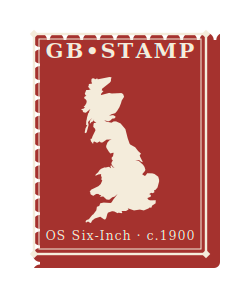

# GB-STAMP

**Semantic Typing of Antiquarian Map Placenames** — recovering feature types for the [GB1900](https://www.visionofbritain.org.uk/gb1900) gazetteer from Ordnance Survey map typography.

GB1900 is a volunteer transcription of every text label on the Ordnance Survey six-inch County Series maps of Great Britain (surveyed c. 1900) — roughly **2.67 million labels**, each a point plus its text. What it lacks is **feature type**: it records *what a label says and where*, but not *what kind of thing it is*.

The Ordnance Survey, however, encoded feature type in its **typography** — italic for water, blackletter for antiquities, roman for settlements, and distinct capitals for each rung of the administrative hierarchy, as documented in its "Characteristic Sheets". **GB-STAMP recovers that lost styling from the scanned maps and turns it back into feature types**: it learns a real-map alphabet for each of the OS's writing faces (seeded from a single Characteristic-Sheet exemplar letter and grown by matching letter-shapes across the maps), gives every label a **best-three** font reading, re-weights those readings with the text and with independent records of civic status (administrative areas, market towns, parliamentary representation), and aligns the result to the Getty Art & Architecture Thesaurus.

### 🗺️ [**Explore the interactive map »**](https://worldhistoricalgazetteer.github.io/gb-stamp/map/)

## Read more

- **[Methodology](https://worldhistoricalgazetteer.github.io/gb-stamp/)** — the source, the limitations of plain GB1900 and its abridgement, and how the method works (plain-terms + academic).
- **[Characteristic-Sheet extraction](https://worldhistoricalgazetteer.github.io/gb-stamp/characteristic-sheets)** — every OS writing category, with exemplars, letterforms, and AAT mappings.
- **[Interactive map](https://worldhistoricalgazetteer.github.io/gb-stamp/map/)** — all 2.67M crowd labels, coloured by recovered feature type, with a toggleable OS sheet grid and per-sheet stats.
- **[Web-map feasibility](https://worldhistoricalgazetteer.github.io/gb-stamp/webmap)** — a static, serverless, searchable MapLibre interface over 2.67M points (PMTiles + IndexedDB, hosted from GitHub Releases).
- **[Licensing](https://worldhistoricalgazetteer.github.io/gb-stamp/licensing)**.

> **Status:** research in progress. This repository documents the approach ahead of full evaluation; accuracy, coverage, and honest characterisation of the limits will be published as the work is validated. The enriched dataset will be distributed as a [GitHub Release](https://github.com/WorldHistoricalGazetteer/gb-stamp/releases).

## Acknowledgements

Builds on **GB1900** (Great Britain Historical GIS / *A Vision of Britain through Time* — Humphrey Southall, University of Portsmouth — with the National Library of Scotland, Aberystwyth University, and People's Collection Wales). Labels are located with **[MapReader](https://github.com/maps-as-data/MapReader)** — Wood et al. (2024), *MapReader: Open software for the visual analysis of maps*, Journal of Open Source Software 9(101):6434, [doi:10.21105/joss.06434](https://doi.org/10.21105/joss.06434) (maps-as-data; developed at Living with Machines / The Alan Turing Institute — Rosie Wood, Kasra Hosseini, Katherine McDonough et al.). Characteristic-Sheet scans by the **National Library of Scotland** (CC-BY); feature types from the Getty **AAT** (ODC-BY). Computation ran on the **University of Pittsburgh Center for Research Computing and Data** (RRID:SCR_022735), supported by NIH award S10OD028483 and NSF award OAC-2117681. Developed by **Stephen Gadd** within the [World Historical Gazetteer](https://whgazetteer.org).

## Licence

**Code: MIT. Data & documentation: CC-BY 4.0** (the GB1900 raw dump is CC0, so CC-BY is the most open licence compatible with the attribution-bearing sources). **Any re-use must credit Stephen Gadd and the World Historical Gazetteer.** See [`LICENSE`](LICENSE) and [licensing](https://worldhistoricalgazetteer.github.io/gb-stamp/licensing).
