# The Ordnance Survey Characteristic Sheets

The Ordnance Survey published **"Characteristic Sheets"** — reference keys to the lettering it used on
its maps. GB-STAMP is grounded in the sheet
**["Examples for the Characters of the Writing on the Engraved Six-Inch Ordnance Maps of Great Britain" (1897)](https://maps.nls.uk/view/128076792)**,
digitised by the **National Library of Scotland** (reproduced under CC-BY), together with the later
(c. 1923) revision.

These sheets are the Rosetta Stone of the project: they record the Ordnance Survey's *own* rule that
**the style of the lettering encodes the kind of feature**. Two points are worth emphasising because they
do a lot of work in the method:

- **Administrative levels are distinguished by different ALL-CAPITALS and fancy faces.** Counties,
  divisions of counties, hundreds, ancient parishes, civil parishes/townships, liberties, boroughs and wards
  are *not* all set the same way — each rung of the administrative hierarchy has its own capital or
  decorated letterform, so the typography alone signals *which level of jurisdiction* a name belongs to.
- **The convention changed in 1879.** Names marked † on the sheet were lettered one way before 1879 and
  differently after, so the style→type mapping is **edition-dependent**: we key each label to its sheet's
  publication date.

Below is our machine-readable extraction of the sheet — the categories, an exemplar clipped from the sheet
itself, the letterform we assign, the date regime, and the Getty **Art & Architecture Thesaurus** term the
category maps to. AAT mappings are still being finalised; cells marked *in progress* are not yet resolved.

<table class="cs-table">
<thead><tr><th>Exemplar</th><th>Category</th><th>Group</th><th>Letterform</th><th>Date regime</th><th>Getty AAT</th></tr></thead>
<tbody>
<tr><td>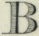</td><td><b>Boroughs (Municipal)</b></td><td>admin</td><td>Upright <b>CAPS</b></td><td class="muted">any edition</td><td><a href="http://vocab.getty.edu/page/aat/300000778">boroughs</a> aat:300000778</td></tr>
<tr><td>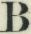</td><td><b>Boroughs (Parliamentary)</b></td><td>admin</td><td>Upright <b>CAPS</b></td><td class="muted">any edition</td><td><a href="http://vocab.getty.edu/page/aat/300000778">boroughs</a> aat:300000778</td></tr>
<tr><td>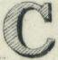</td><td><b>Cities not returning Members</b></td><td>admin</td><td>Upright <b>CAPS</b></td><td class="muted">† pre-1879</td><td>— (in progress)</td></tr>
<tr><td></td><td><b>Cities returning Members</b></td><td>admin</td><td>Upright <b>CAPS</b></td><td class="muted">† pre-1879</td><td>— (in progress)</td></tr>
<tr><td>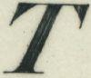</td><td><b>Civil Parishes or Townships</b></td><td>admin</td><td>Upright <b>CAPS</b></td><td class="muted">any edition</td><td><a href="http://vocab.getty.edu/page/aat/300387092">parishes</a> aat:300387092</td></tr>
<tr><td>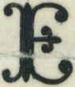</td><td><b>County Boroughs</b></td><td>admin</td><td>Upright <b>CAPS</b></td><td class="muted">‡ post-1879 (more recent maps)</td><td><a href="http://vocab.getty.edu/page/aat/300000778">boroughs</a> aat:300000778</td></tr>
<tr><td>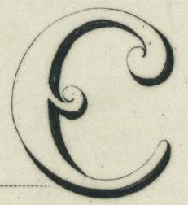</td><td><b>County Names</b></td><td>admin</td><td>Upright <b>CAPS</b></td><td class="muted">any edition</td><td><a href="http://vocab.getty.edu/page/aat/300000771">counties</a> aat:300000771</td></tr>
<tr><td>—</td><td><b>Divisions of Counties (Ridings)</b></td><td>admin</td><td>Upright <b>CAPS</b></td><td class="muted">† pre-1879</td><td>— (in progress)</td></tr>
<tr><td>—</td><td><b>Divisions of Townships</b></td><td>admin</td><td>Upright <b>CAPS</b></td><td class="muted">† pre-1879</td><td>— (in progress)</td></tr>
<tr><td>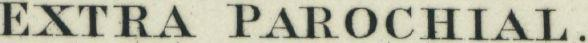</td><td><b>Extra Parochial</b></td><td>admin</td><td>Upright roman</td><td class="muted">† pre-1879</td><td>— (in progress)</td></tr>
<tr><td>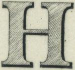</td><td><b>Hundreds</b></td><td>admin</td><td>Upright <b>CAPS</b></td><td class="muted">† pre-1879</td><td>— (in progress)</td></tr>
<tr><td>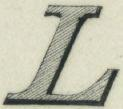</td><td><b>Liberties</b></td><td>admin</td><td>Upright <b>CAPS</b></td><td class="muted">any edition</td><td>— (in progress)</td></tr>
<tr><td>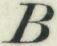</td><td><b>Market Towns</b></td><td>admin</td><td>Upright <b>CAPS</b></td><td class="muted">† pre-1879</td><td><a href="http://vocab.getty.edu/page/aat/300008423">market towns</a> aat:300008423</td></tr>
<tr><td>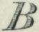</td><td><b>Other Towns</b></td><td>admin</td><td>Upright <b>CAPS</b></td><td class="muted">† pre-1879</td><td>— (in progress)</td></tr>
<tr><td>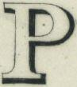</td><td><b>Parishes (Mother or Ancient)</b></td><td>admin</td><td>Upright <b>CAPS</b></td><td class="muted">† pre-1879</td><td><a href="http://vocab.getty.edu/page/aat/300387092">parishes</a> aat:300387092</td></tr>
<tr><td>—</td><td><b>Parliamentary Division of Counties</b></td><td>admin</td><td>Upright <b>CAPS</b></td><td class="muted">‡ post-1879 (more recent maps)</td><td>— (in progress)</td></tr>
<tr><td>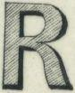</td><td><b>Poor Law Unions</b></td><td>admin</td><td>Upright <b>CAPS</b></td><td class="muted">any edition</td><td>— (in progress)</td></tr>
<tr><td>—</td><td><b>Subdivisions of Townships</b></td><td>admin</td><td>Upright <b>CAPS</b></td><td class="muted">† pre-1879</td><td>— (in progress)</td></tr>
<tr><td>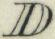</td><td><b>Town Districts</b></td><td>admin</td><td>Upright <b>CAPS</b></td><td class="muted">‡ post-1879 (more recent maps)</td><td><a href="http://vocab.getty.edu/page/aat/300008423">market towns</a> aat:300008423</td></tr>
<tr><td>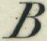</td><td><b>Towns, generally</b></td><td>admin</td><td>Upright <b>CAPS</b></td><td class="muted">any edition</td><td>— (in progress)</td></tr>
<tr><td>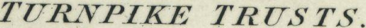</td><td><b>Turnpike Trusts</b></td><td>admin</td><td>Upright roman</td><td class="muted">† pre-1879</td><td>— (in progress)</td></tr>
<tr><td>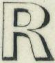</td><td><b>Urban Sanitary Districts</b></td><td>admin</td><td>Upright <b>CAPS</b></td><td class="muted">any edition</td><td>— (in progress)</td></tr>
<tr><td></td><td><b>Wards</b></td><td>admin</td><td>Upright <b>CAPS</b></td><td class="muted">any edition</td><td>— (in progress)</td></tr>
<tr><td>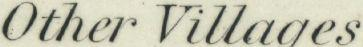</td><td><b>Other Villages</b></td><td>settlement</td><td>Upright roman</td><td class="muted">any edition</td><td>— (in progress)</td></tr>
<tr><td>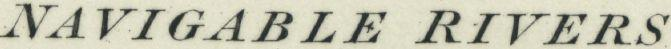</td><td><b>Navigable Rivers and Canals</b></td><td>water</td><td>Italic</td><td class="muted">any edition</td><td>— (in progress)</td></tr>
<tr><td>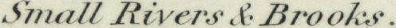</td><td><b>Small Rivers &amp; Brooks</b></td><td>water</td><td>Italic</td><td class="muted">any edition</td><td>— (in progress)</td></tr>
<tr><td>—</td><td><b>Antiquities: Norman or Subsequent</b></td><td>antiquity</td><td>gothic_blackletter</td><td class="muted">any edition</td><td><a href="http://vocab.getty.edu/page/aat/300387092">parishes</a> aat:300387092</td></tr>
<tr><td>—</td><td><b>Antiquities: Pre-historic or Saxon</b></td><td>antiquity</td><td>gothic_blackletter</td><td class="muted">any edition</td><td><a href="http://vocab.getty.edu/page/aat/300387092">parishes</a> aat:300387092</td></tr>
<tr><td>—</td><td><b>Antiquities: Roman</b></td><td>antiquity</td><td>gothic_blackletter</td><td class="muted">any edition</td><td>— (in progress)</td></tr>
<tr><td>—</td><td><b>Bays and Harbours</b></td><td>coastal_water</td><td>Upright roman</td><td class="muted">any edition</td><td><a href="http://vocab.getty.edu/page/aat/300008678">harbors</a> aat:300008678</td></tr>
<tr><td>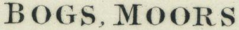</td><td><b>Bogs, Moors and Forests</b></td><td>land</td><td>Upright roman · size-variable</td><td class="muted">any edition</td><td><a href="http://vocab.getty.edu/page/aat/300386886">moors (landforms)</a> aat:300386886</td></tr>
<tr><td>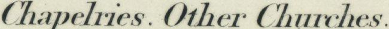</td><td><b>Chapelries, Other Churches</b></td><td>settlement_building</td><td>Upright roman</td><td class="muted">† pre-1879</td><td><a href="http://vocab.getty.edu/page/aat/300004590">chapels (rooms or structures)</a> aat:300004590</td></tr>
<tr><td>—</td><td><b>County Bridges, Trust Bridges and Others, Isolated Houses</b></td><td>building_structure</td><td>Upright roman</td><td class="muted">any edition</td><td><a href="http://vocab.getty.edu/page/aat/300007836">bridges (built works)</a> aat:300007836</td></tr>
<tr><td>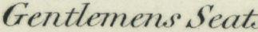</td><td><b>Gentlemen&#x27;s Seats</b></td><td>building</td><td>Upright roman</td><td class="muted">any edition</td><td><a href="http://vocab.getty.edu/page/aat/300005567">country houses</a> aat:300005567</td></tr>
<tr><td>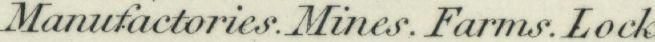</td><td><b>Manufactories, Mines, Farms, Locks</b></td><td>building_industry</td><td>Upright roman</td><td class="muted">any edition</td><td><a href="http://vocab.getty.edu/page/aat/300000206">farms</a> aat:300000206</td></tr>
<tr><td>—</td><td><b>Other Stations</b></td><td>railway</td><td>Upright roman</td><td class="muted">any edition</td><td><a href="http://vocab.getty.edu/page/aat/300007783">railroad stations</a> aat:300007783</td></tr>
<tr><td>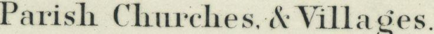</td><td><b>Parish Churches &amp; Villages</b></td><td>settlement_building</td><td>Upright roman</td><td class="muted">any edition</td><td><a href="http://vocab.getty.edu/page/aat/300007466">churches (buildings)</a> aat:300007466</td></tr>
<tr><td>—</td><td><b>Parks and Demesnes</b></td><td>land</td><td>Upright roman</td><td class="muted">any edition</td><td><a href="http://vocab.getty.edu/page/aat/300159932">educational parks</a> aat:300159932</td></tr>
<tr><td>—</td><td><b>Principal Stations</b></td><td>railway</td><td>Upright roman</td><td class="muted">any edition</td><td><a href="http://vocab.getty.edu/page/aat/300007783">railroad stations</a> aat:300007783</td></tr>
<tr><td>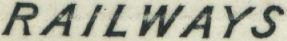</td><td><b>Railways (Mineral)</b></td><td>railway</td><td>Italic</td><td class="muted">any edition</td><td><a href="http://vocab.getty.edu/page/aat/300386657">railroads (administrative)</a> aat:300386657</td></tr>
<tr><td>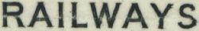</td><td><b>Railways (Passenger)</b></td><td>railway</td><td>Upright roman</td><td class="muted">any edition</td><td><a href="http://vocab.getty.edu/page/aat/300386657">railroads (administrative)</a> aat:300386657</td></tr>
<tr><td>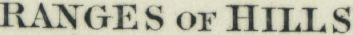</td><td><b>Ranges of Hills (Separate parts / Single Features)</b></td><td>landform</td><td>Upright roman · size-variable</td><td class="muted">any edition</td><td><a href="http://vocab.getty.edu/page/aat/300008777">hills (landforms)</a> aat:300008777</td></tr>
<tr><td>—</td><td><b>Woods and Copses</b></td><td>land</td><td>Upright roman</td><td class="muted">any edition</td><td>— (in progress)</td></tr>
<tr><td>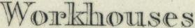</td><td><b>Workhouses</b></td><td>building</td><td>Upright roman</td><td class="muted">any edition</td><td><a href="http://vocab.getty.edu/page/aat/300006490">workhouses (buildings)</a> aat:300006490</td></tr>
</tbody>
</table>

*Exemplar strips are clipped from the NLS scan of the 1897 Characteristic Sheet (CC-BY). 44 categories extracted.*

[← Back to the methodology](index.md)
