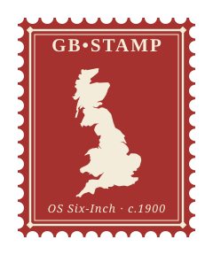

# GB-STAMP

**GB-STAMP — *Semantic Typing of Antiquarian Map Placenames*** — gives the [GB1900](https://www.visionofbritain.org.uk/gb1900) gazetteer a sense of **what** each place is, not just its name and location, by reading the Ordnance Survey's own map **typography**. (The name is also a small pun: the Ordnance Survey *stamped* a distinct lettering style onto every kind of feature when it engraved its plates; GB-STAMP reads that stamp back.)

*A methodology note. Results are pending; this page describes the source, its limitations, and our approach. Accuracy, coverage, and an honest account of the limits will be added as the work is validated.*

---

## 1. The source, in plain terms

Between roughly 2016 and 2018, a large volunteer effort called **[GB1900](https://www.visionofbritain.org.uk/gb1900)** transcribed **every piece of text printed on the Ordnance Survey's "six-inch to one mile" County Series maps of Great Britain** — the detailed edition surveyed in the decades around 1900. Thousands of volunteers read the maps sheet by sheet and typed out what each label said, pinning it to the exact spot on the map where it appeared.

The result is extraordinary: a gazetteer of roughly **2.67 million labels**, each one a **point on the map plus the text that was written there** — farm names, streams, churches, wells, footpaths, ancient monuments, quarries, milestones, and much more. It is one of the richest historical snapshots of the British landscape ever assembled, and it was released for reuse under an open licence (CC-BY-SA).

GB1900 grew out of the **Great Britain Historical GIS** and **[A Vision of Britain through Time](https://www.visionofbritain.org.uk)**, the long-running project led by **Humphrey Southall** at the University of Portsmouth, and was delivered as a partnership with the National Library of Scotland, Aberystwyth University, People's Collection Wales, and its many volunteers.

---

## 2. What plain GB1900 does *not* tell you

GB1900 records **what a label says and where it is** — but not **what kind of thing it refers to**. To the dataset, `Tumulus`, `Smithy`, `Ford`, `St Mary's Church`, and `Manor Farm` are all just strings of text at points. There is no field that says "this is an *antiquity*", "this is a *water feature*", "this is a *place of worship*".

That missing layer — **feature type** — is exactly what turns a list of names into something you can *search*, *filter*, *map thematically*, and *link* to other gazetteers and authorities. Without it you cannot ask questions like *"show me every ancient monument in Wales"* or *"map all the watermills in the Pennines"*, even though the data to answer them is sitting right there in the labels.

Two further wrinkles are worth knowing:

- **The Abridged gazetteer.** GB1900 is distributed both as a **Complete** gazetteer and as a smaller **Abridged** one. The Abridged version strips out the huge number of repetitive, generic labels — the endless `F.P.` (foot path), `Well`, `P` (post), `Spr` (spring), spot heights, and boundary marks — to leave a cleaner set of *distinctive* names. That makes it more manageable, but it **discards real evidence**: those repeated labels are genuine features on the ground, and the abridgement also removes many duplicate instances of the same name. For landscape-scale analysis the Complete gazetteer is richer but noisier; the Abridged one is tidier but partial.
- **It is points, not shapes, and transcriptions, not truth.** Every entry is a single point (not the extent of a wood or the line of a river), and every entry is a human transcription of century-old print — so there are reading errors, abbreviations, and inconsistencies to contend with.

---

## 3. Our idea: let the map's *typography* tell us the type

The Ordnance Survey did not choose fonts at random. Across its maps it used a **deliberate, documented system of typography** in which *the style of the lettering encodes the kind of feature*:

- **Water and natural features** (rivers, brooks, springs) are set in a **sloping *italic*** serif.
- **Antiquities** (tumuli, cairns, camps, the sites of former buildings) are set in an ornate **blackletter / Gothic** hand — and, in fact, in *four* distinct antiquity styles depending on period.
- **Settlements, civil features, and buildings** (churches, schools, woods) are set in an **upright roman**.
- **Administrative units are distinguished by different ALL-CAPITALS and fancy faces** — counties, divisions, hundreds, ancient and civil parishes, liberties, boroughs and wards each have their *own* capital or decorated letterform, so the lettering alone tells you *which rung of the administrative hierarchy* a name belongs to.
- **Heights, bench-marks, and boundary marks** have their own numeral and symbol conventions.

These conventions are laid out in the Ordnance Survey's own reference documents, the **Characteristic Sheets** — the map-maker's key to its own visual language. In other words, the OS already *classified* every feature when it drew the map; it simply encoded that classification in **how the words look** rather than in a separate label. Crucially, the convention **changed in 1879**, so the style→type mapping is edition-dependent, and we key each label to the publication date of its sheet.

**[→ See our full extraction of the Characteristic Sheets](characteristic-sheets.md)** — every writing category, an exemplar clipped from the sheet, the letterform, the date regime, and its Getty AAT mapping.

GB1900 volunteers transcribed the *words* but, understandably, not the *style* they were printed in. **GB-STAMP recovers that lost styling from the original scanned maps and turns it back into feature types.**

### How it works, step by step

1. **Find the words on the map.** We locate the text on the scanned map image and delineate it cleanly with
   **[MapReader](https://github.com/maps-as-data/MapReader)**, a text-spotting toolkit for historical maps.
   This gives a tidy picture of each word in its original font — not just the transcribed text.
2. **Join the words into labels.** A spotter finds *words*; a gazetteer needs *labels*, and many OS labels
   run to several words or several lines. Each word's own typography — its direction, cap height and
   character pitch — says where its continuation must be, and a label set on more than one line is
   recognised by its lines sharing a size, a direction and a common perpendicular centre. GB1900 is an
   unusually good test set for this step, because a volunteer's transcription names every word of a label,
   so the join can be scored without any new annotation.
   **[→ How the join works, and what it achieves](label-assembly.md)**
3. **Read the lettering face.** Every label is compared against a set of verified real-map reference
   examples for each OS writing face, letter against like letter, so what a label *says* never leaks into
   what face it is judged to be. Whole-word slant — measured by searching for the shear that best squares up
   the word, not by the lean of its ink — is fused in as an independent signal.
4. **Best three guesses, then arbitrate with text.** Some OS faces are genuinely alike, and a few categories
   were engraved in an *identical* face, so each label gets a ranked **top-three** reading with confidences
   rather than a single verdict. Those are then re-weighted by evidence the letterforms cannot see: which
   words co-occur with which face across the corpus, and independent records of the civic status the OS
   capitals were themselves encoding.
5. **Map to a shared vocabulary.** The recovered types are aligned to the Getty **Art & Architecture
   Thesaurus**, so the enriched gazetteer can be searched, filtered and linked to other datasets.

### What is honest to say at this stage

This is a research method, and we report it *before* the final numbers so the approach can be scrutinised.
The letterform signal is strongest for the visually distinctive faces — the ornate administrative capitals,
the blackletter antiquity hands, the numerals — and weakest for the plain serif faces used for ordinary
names, which even a careful eye finds marginal at this map scale. Where two OS categories were engraved in
the *same* face they are inseparable by design; rather than pretend to split them, we identify such pairs
and merge them under human review. The best-three output, with the text and civic re-weighting, exists
precisely so that hard or shared faces degrade gracefully instead of producing false certainty.

The method is **specific to this map series**, by choice. Earlier drafts aimed at something
series-independent; we have instead leaned on what the Ordnance Survey's own conventions guarantee — a fixed
face inventory, letter-spacing reserved for administrative lettering, numerals set apart from place names —
because accuracy on these maps matters more to the resulting gazetteer than generality across others.

---

## 4. Results so far

*Research in progress. The figures below are measured; where something is not yet measured, it is said so.*

### Joining words into labels — measured

The largest piece of validated work to date is the step that turns a text spotter's **words** into whole
**labels**. Scored on 5,037 GB1900 labels in map regions the method was never trained on, counting a success
only when the assembled label reproduces the volunteer's transcription **exactly**:

| method | exact reproduction |
|---|---|
| nearest single word alone | 0.219 |
| hand-set geometric rules | 0.381 |
| learned join + sequence constraint | **0.425** |

Recognition is not the limiting factor — on the 93% of labels read without a single unknown character, where
a mismatch must be a *grouping* error, the figure is 0.449. The join decision itself is accurate (held-out
pairwise AUC 0.957); the difficulty is in assembling accurate pairwise decisions into whole labels without
letting errors compound.

**[→ Full account, including two approaches that did not work](label-assembly.md)**

### Reading the lettering — in progress

The Characteristic Sheets describe **44 writing categories**, but many of them are engraved in the *same*
face — the sheets distinguish them by name, not always by letterform. Collapsing the identical ones under
human review gives a working inventory of **15 distinguishable faces**, of which **9 currently carry
verified real-map reference labels** (951 in total). The remaining six are rare enough that we have not yet
found confirmed examples, and we would rather report an empty class than a guessed one.

Two of those merges are worth stating plainly, because they are limits of the source rather than of the
method. Prehistoric/Saxon and Norman antiquities are both blackletter, but the cut varies so much between
instances that a human reviewer could not reliably separate them — a distinction nobody can make by eye is
not one to ask a matcher for. And the heavier italic used for *Chapelries and Other Churches* differs from
the lighter italic of fifteen other categories only in the terminals of a lowercase **s**, which is finer
than a size-normalised glyph can carry. Both are recorded as single faces rather than split on faith.

**Whole-word slant is a real and independent signal**, and how it is measured matters: searching for the
shear that best squares up a word separates upright from italic well, whereas the more obvious measure —
the lean of the ink itself — scores barely above chance, because it mostly reports where a word's ascenders
happen to fall. Fusing slant with the letterform comparison improves balanced accuracy materially, and the
combined reading agrees with human judgement on 0.886 of a held-out sample of 300.

**Adding more reference examples to the faces we already know well buys almost nothing** — a further 274
moved balanced accuracy by 0.010, where the slant signal moved it by 0.063. The constraint is the *breadth*
of faces covered, not the depth of any one.

### Text-based typing — national in scope

Independently of the typographic reading, the current edition assigns a feature type to **871,359 of the
2,666,341 labels (32.7%)**, across **15 Getty-AAT-aligned classes**, derived from the OS-grounded lexicon and
the OS single-letter abbreviation conventions (a standalone italic *W* = *well*, ~191k labels). Because that
typing rests on the text, it is already national in scope. The remaining ~67% are as yet untyped and are
shown in grey on the map.

**Where the font signal earns its place** is in disambiguating text that the words alone cannot settle.
"Camp", "Castle", "Cross" and "Stone" mean an *antiquity* in the antiquity hand but a modern feature in roman
or italic, so typing is **font-conditioned** for exactly the cases a lexicon gets wrong.

### Not yet measured

The headline question — **what proportion of labels GB1900 and GB-STAMP each miss** — is deliberately not
quoted here yet. A first attempt was contaminated: some map regions had been processed while the tile service
was failing, and had recorded almost no text despite the maps being full of it. Those regions look identical
to genuinely empty countryside in the output, so the measurement was quietly counting an infrastructure
failure as a detection failure. The regions are being reprocessed, and each now records how much imagery it
actually saw, so a starved run can never again pass for a quiet one.

## Getting the data

The enriched gazetteer is published as a **[GitHub Release](https://github.com/WorldHistoricalGazetteer/gb-stamp/releases)** — the simplest "download directly from GitHub" route. The current preview, **[v0.1.0-alpha](https://github.com/WorldHistoricalGazetteer/gb-stamp/releases/tag/v0.1.0-alpha)**, contains the full **2,666,341-record** edition (gzipped JSONL, ~60 MB). Each record carries the raw text + coordinates (CC0 raw dump), a clean feature type + Getty AAT mapping where assigned, and the recovered lettering style where the sheet has been read.

**[→ Browse the interactive map](map/)** · **[web-map feasibility / scale-up note](webmap.md)**

*Alpha preview: feature type is drawn from the OS-grounded lexicon and abbreviation conventions; the full typographic reading is being built and its coverage will grow.*

---

## 5. Why it matters

If it works, GB-STAMP adds the one thing GB1900 lacks: a **feature-type layer** over 2.67 million historical labels, derived not from guesswork but from the Ordnance Survey's *own* classification as expressed in its typography. That makes the whole corpus **thematically searchable and mappable**, and connectable to the wider ecosystem of historical gazetteers — including the [World Historical Gazetteer](https://whgazetteer.org).

---

## Acknowledgements

- **GB1900** was created by thousands of volunteers and by the **Great Britain Historical GIS / A Vision of Britain through Time** (**Humphrey Southall**, University of Portsmouth), the **National Library of Scotland**, **Aberystwyth University**, and **People's Collection Wales**. GB-STAMP builds directly on their work.
- Labels are located and delineated with **[MapReader](https://github.com/maps-as-data/MapReader)** — Wood, R., Hosseini, K., Westerling, K., Smith, A., Beelen, K., Wilson, D.C.S., & McDonough, K. (2024). *MapReader: Open software for the visual analysis of maps.* Journal of Open Source Software, 9(101), 6434. [doi:10.21105/joss.06434](https://doi.org/10.21105/joss.06434). Maintained by [maps-as-data](https://github.com/maps-as-data); developed at Living with Machines / The Alan Turing Institute.
- The **Ordnance Survey Characteristic Sheets** are reproduced from scans by the **[National Library of Scotland](https://maps.nls.uk/view/128076792)** (CC-BY).
- Feature types use the Getty **Art & Architecture Thesaurus (AAT)**, made available under the [ODC Attribution License](https://www.getty.edu/research/tools/vocabularies/license.html).
- Computation ran on the **HTC, H2P, and GPU clusters at the University of Pittsburgh Center for Research Computing and Data** (RRID:SCR_022735), supported by NIH award S10OD028483 and NSF award OAC-2117681.
- GB-STAMP is developed by **Stephen Gadd** within the **[World Historical Gazetteer](https://whgazetteer.org)** indexing infrastructure.

## Licence

See **[Licensing](licensing.md)**. In brief: the **code** is MIT; the **data and documentation** are **CC-BY 4.0** (the most open licence compatible with the sources — the GB1900 raw dump is CC0, so no share-alike applies). **Any re-use must credit Stephen Gadd and the World Historical Gazetteer**, alongside GB1900 and the other upstream sources.
